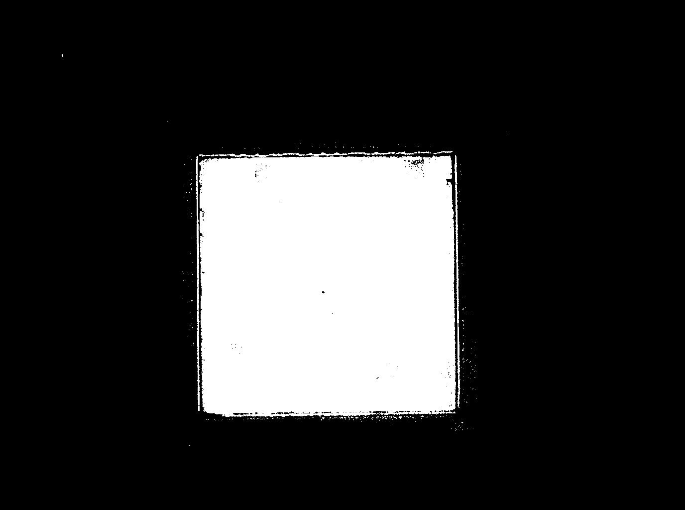
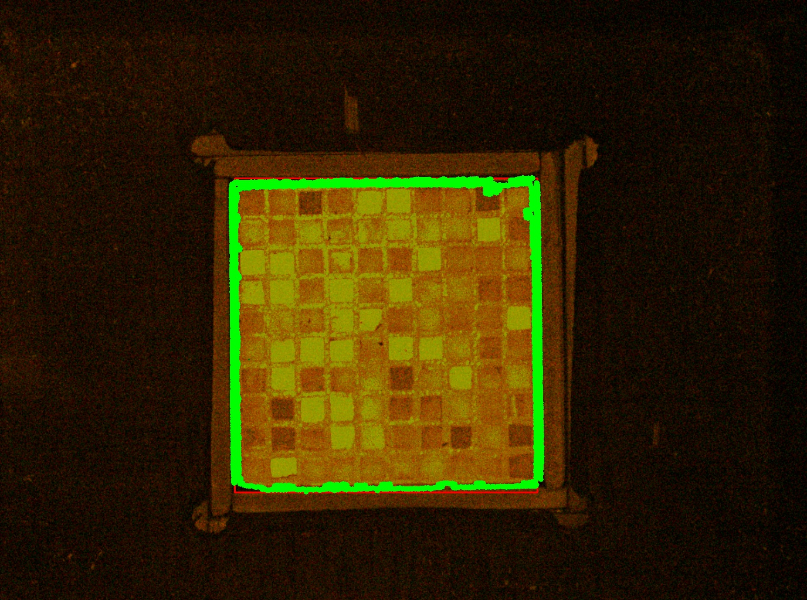
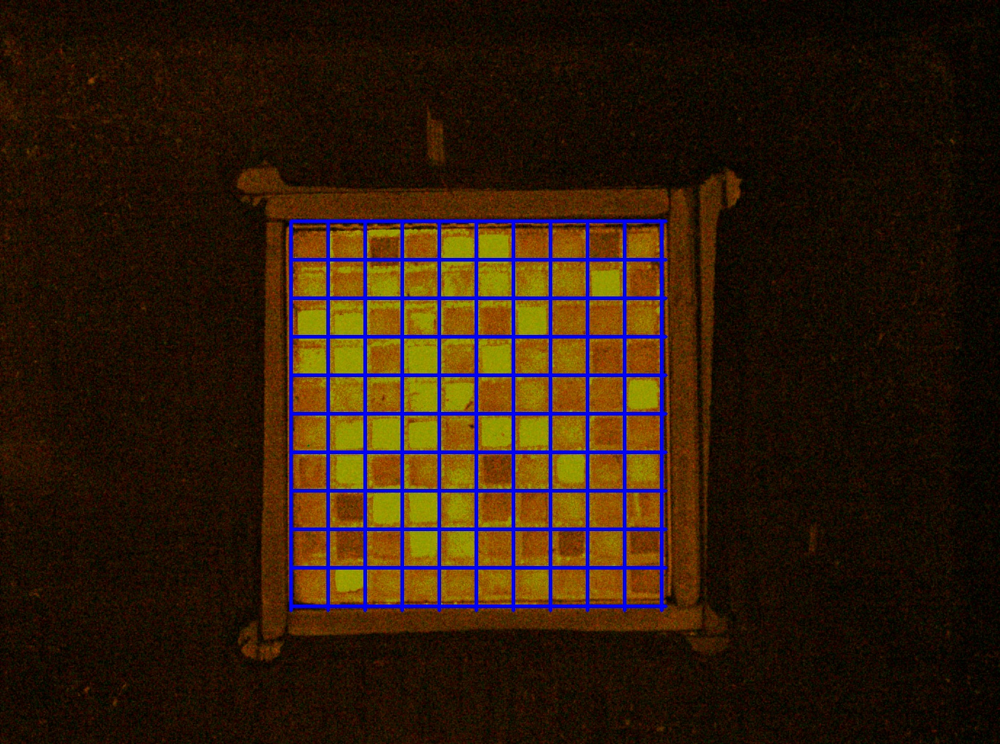
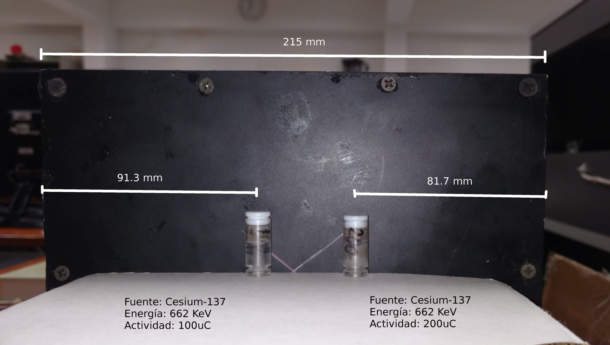
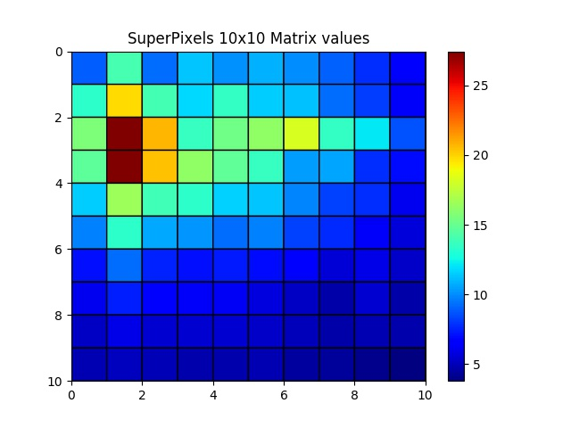
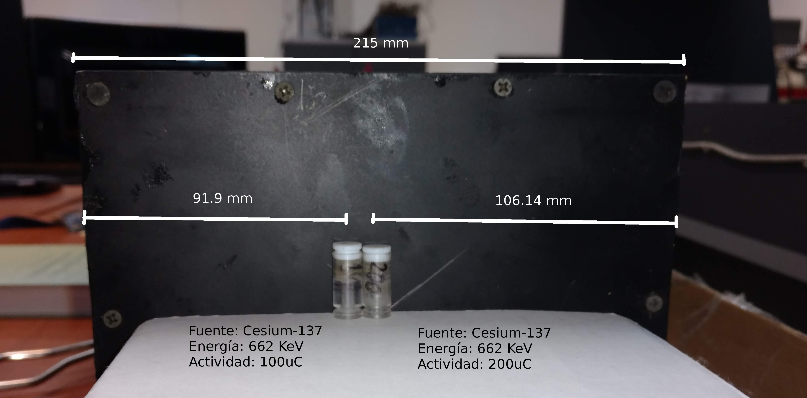
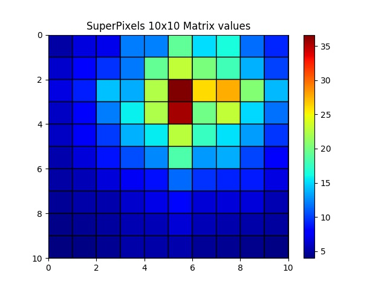

## Gamma Ray Detection

**gamma-ray-detection** detects the high energy values when a CMOS sensor and a 10x10 matrix of collimated scintillator crystals are exposed to a radioactive source that emits gamma-ray beams. The camera and the scintillator are inside of a light-trap black box (gamma camera).

### Python classes

Two python classes have been developed: 
* _ImageProcessing_: processes the features of the image (filtering, canny and segmentation) to get the calibration parameters, which determine the scintillator dimension.
* _GammaDetection_: calculates the values of the superpixels in the 10x10 matrix and determinates the centroid. The superpixel size depends on the focal distance lens and sensor size of the camera.


### Python scripts

First, the equipment (camera + 10x10 matrix scintillator crystals) must be calibrated  with the _setCalibrationGrid.py_ script. In this stage images with the following features are used:

* Light: LED inside the equipment
* Exposure time: 1 second
* Depth: 8-bit

```sh
ahestevenz@columbia:~/IP/work/gamma-ray-detection$ python setCalibrationGrid.py -h
usage: setCalibrationGrid.py [-h] -d DIRECTORY -b BACKGROUND -i INDEX
                             [-m FRAME] [-f FILE_CALIB] [-s] [-v] [-w]

optional arguments:
  -h, --help            show this help message and exit
  -d DIRECTORY, --directory DIRECTORY
                        path to directory of images acquire with the calibration
                        set
  -b BACKGROUND, --background BACKGROUND
                        path to directory of images acquire in background
  -i INDEX, --index INDEX
                        image index for the image processing in the directory
  -m FRAME, --frame FRAME
                        frame of the image selected, the default value is 0
  -f FILE_CALIB, --file_calib FILE_CALIB
                        calibration file location
  -s, --show            show graphics
  -v, --verbose         verbose mode
  -w, --write_images    save images

```
Then, the size of the scintillator crystal is obtained as follows,

```sh
Threshold detects a square

Corrected Shape
| x | y | width | height |
| 400 | 304 | 516 | 536 |
``` 
|  |  |  |
|:---:|:---:|:---:|
| Edge Detection | Mask | Grid |

Then superpixels (10x10 crystals matrix) are carried out by the _getCentroids.py_ script. Here, images with following features are used:

* Light: from radioactive source
* Exposure time: 6 minutes
* Depth: 8-bit

```sh
ahestevenz@columbia:~/IP/work/gamma-ray-detection$ python getCentroids.py -h
usage: getCentroids.py [-h] -r RADIOACTIVE_SOURCE -b BACKGROUND -i INDEX
                       [-m FRAME] [-f FILE_CALIB] [-s] [-v] [-w]

optional arguments:
  -h, --help            show this help message and exit
  -r RADIOACTIVE_SOURCE, --radioactive_source RADIOACTIVE_SOURCE
                        path to essay directory of images acquire with
                        the radioactive sources
  -b BACKGROUND, --background BACKGROUND
                        path to essay directory of images acquire in
                        background
  -i INDEX, --index INDEX
                        image index for the image processing in the essay
                        directory
  -m FRAME, --frame FRAME
                        frame of the image selected, the default value is 0
  -f FILE_CALIB, --file_calib FILE_CALIB
                        calibration file location
  -s, --show            show graphics
  -v, --verbose         verbose mode
  -w, --write_images    save images
```
### Results

The results from _getCentroids.py_ is a cualitative _pcolor_ graph with the grid of superpixels, as we can observe below,

* Essay 1

|  |  | 
|:---:|:---:|
| Radioactive sources location (*) | Results |

* Essay 2

|  |  | 
|:---:|:---:|
| Radioactive sources location (*) | Results |

(*) _Note: The picture appear mirrored respect to the results_

